# Relay Toon — AI를 활용한 협업 릴레이 웹툰

> AI가 세계관을 기억하고 관리하며, 여러 사용자가 하나의 작품을 함께 만들어가는 **협업형 웹툰 플랫폼**

**🖥️ 서비스 목업 바로가기 → [funjo-b.github.io/relay_toon/mockup](https://funjo-b.github.io/relay_toon/mockup/)**  
**🖥️ 랜딩 페이지 바로가기 → [https://relay-toon-landing.vercel.app](https://relay-toon-landing.vercel.app/)**

기존 웹툰 플랫폼이 작가 중심의 단방향 콘텐츠라면, Relay Toon은 **AI + 사용자 + 커뮤니티**가 함께 하나의 IP를 성장시키는 것을 목표로 한다.
핵심은 단순한 웹툰 생성이 아니라 **살아있는 세계관(Living Story World)** 을 만드는 것이다.

---

## 🎯 타겟층

- 만화를 좋아하는 사람 (독자)
- AI로 웹툰을 만들고 싶은 개인 창작자
- 친구·팀과 함께 공동 창작을 하고 싶은 사람

---

## ⚙️ 기능

### 메인 기능 — AI를 활용한 만화 제작

**AI 감독 시스템** : 모든 작품(방)에는 전담 AI가 존재한다.

| 구성 요소 | 설명 |
|---|---|
| AI 감독 | 세계관·캐릭터·스토리 관리, 연출 감독, 설정 검증, 요약 생성, 신규 사용자 안내 |
| AI Story Bible | 세계관·줄거리·등장인물·장소·아이템·떡밥·사건 연표를 자동 생성/관리하는 세계관 문서 (공개 위키 + 비밀 떡밥 볼트의 이중 구조) |
| AI 캐릭터 메모리 | 캐릭터별 고유 ID로 외형·성격·말투·현재 상태를 기억 → 1000화 이후에도 동일 캐릭터 유지 |
| AI 세계관 위키 | 자동 생성되는 위키. 신규 사용자는 위키만 읽어도 바로 참여 가능 |

**세계관 규칙 시스템 — AI는 '설정 경찰'이 아니라 '개연성 심판'**

- **개연성이 제시되면 기존 설정도 바꿀 수 있다** : 반전·복선 회수 같은 설정 변경을 허용하고, Story Bible에 변경 이력으로 기록 (예: "127화 — 철수, 실은 엘프였음이 밝혀짐")
- **방 생성 시 규칙 강도 선택** :
  - 엄격 — 캐논 고정, 변경은 방장/검수자 승인제 (진지한 장편용)
  - 유연 — 개연성만 있으면 누구나 설정 변경 가능 (기본값)
  - 자유 — 개연성 검사 OFF. 철수가 갑자기 엘프든 드워프든 OK (병맛·카오스 릴레이용)
- **자유 모드에서도 '현재 상태 추적'은 유지** : 철수가 엘프가 된 순간부터 AI는 철수를 엘프로 그린다 — 규칙이 없어도 기억은 유지되는 "연속성 있는 카오스"
- 원작 참여자들과 충돌할 만한 큰 변경은 AI가 **브랜치 분기를 제안** (갈등 해소 장치)

**비밀 떡밥 시스템 — 떡밥은 심은 사람만 알고, 정답은 아무의 것도 아니다**

- **떡밥은 비공개** : 등록하면 심은 사람 + AI만 인지. 다른 참여자·독자에게는 그냥 그림의 일부로 보인다 (스포일러 방지). 위키에는 회수 완료된 떡밥만 공개
- **떡밥에 소유권 없음** : 2화 작가가 엘프귀를 의도하고 몰래 그렸어도, 10화 작가가 그 귀를 "뱀파이어 귀"로 회수하면 그게 캐논이 된다 — 심는 것은 예약이 아니라 베팅
- **Story Bible 이중 레이어** : 공개 위키(확정 캐논, 모두 열람) + 비밀 볼트(작성자별 떡밥 의도, 본인과 AI만 열람). AI는 모든 비밀을 알지만 누설하지 않는 중립 심판 — 설정 검증도 그림과의 모순 여부만 본다
- **회수 = 리빌 이벤트** : 떡밥이 회수되는 순간 AI가 원래 의도 vs 실제 회수를 공개. 적중이면 "설계", 다르면 "반전" — 둘 다 콘텐츠가 되고, 심은 사람과 회수한 사람 모두 스토리 기여 점수를 받는다

**제작 방식**

- **간단한 입력** : 긴 프롬프트 불필요. `"철수가 복도를 걷는다."` 한 줄이면 AI가 컷 구성·카메라·배경·조명·표정·말풍선·연출을 자동 생성
- **자연어 대화형 감독** : AI가 연출을 제안하고, 다음 참여자가 이어가기 쉽게 마무리 컷을 설계
- **말풍선·대사 자동화** : 대사만 자연어로 입력하면 말풍선 위치·글자 크기·강조 효과·효과음을 자동 배치, 필요 시 대사 추천/수정안 제시
- **3컷 단위 제작** : 사용자는 1~3컷 중 원하는 만큼만 작성, 빈 컷은 AI가 자동 생성
- **세계관 확장** : 병맛 → 로맨스 → 판타지 → SF처럼 장르를 추가해도 AI가 기존 설정을 유지하며 자연스럽게 반영

### 부가 기능 (메인 기능을 활용한 추가 기능들)

#### 개인

- **개인 작가 연재 모드** : AI 어시스턴트와 함께 혼자 연재. 이후 공개 및 브랜치 허용 여부 선택 가능
- **콘텐츠 소비** : 무료 / 광고 시청 / 구독(광고 제거) 중 선택하여 감상
- **커뮤니티** : 댓글, 좋아요, 명장면 저장, 팔로우, 방·장르 검색, 인기 브랜치/세계관 탐색

#### 모임

- **비공개 협업 모드** : 초대 코드 기반 팀 창작. 운영 방식은 방장이 선택 —
  - *역할 분담형* : 방장 · 작성자 · 검수자 · 열람자로 나눠 운영 (체계적인 팀용)
  - *공동 감독형* : 역할 구분 없이 **모두가 감독이자 작화가** — 누구나 그리고, 누구나 연출을 제안한다. 충돌 조율은 AI 감독이 담당
- **공개 릴레이 모드** : 누구나 참여하는 3컷 단위 릴레이. 종료 없는 웹툰, AI가 세계관 유지
- **브랜치 모드** : 원작의 원하는 화에서 새로운 세계선 분기
  - 원작 설정과 AI Story Bible 자동 복사 → 독립적인 평행세계 운영
  - 브랜치에서 다시 브랜치 생성 가능, 독자는 원하는 세계선 선택
- **다수 참여형 이벤트 모드** : 하루 한 컷 이어그리기, 랜덤 장르, 공포 릴레이, 병맛 챌린지, 기업 콜라보 이벤트

---

## 💰 수익구조

### 플랫폼 수익

- 광고 (무료 이용자 대상)
- 구독 (광고 없는 감상)
- 후원
- IP 라이선스

### 창작자 보상 — 기여도 기반 자동 분배

- **기여도 산정** : 참여량, 조회수, 좋아요, AI 평가, 독자 평가, 스토리 기여도
- **지급 방식** : 현금 또는 AI 토큰

### AI 토큰

| 획득 | 사용 |
|---|---|
| 창작, 조회수, 좋아요, 이벤트, 광고 참여 | AI 생성, 고속 생성, 고화질, AI 수정, 특별 효과, 프리미엄 기능 |

---

## 🚀 향후 확장

AI가 인기 작품을 분석하여 IP를 다각도로 확장:

- 단행본 제작 / 굿즈 제작
- 숏폼 애니메이션 생성 / 애니메이션 제작 / AI 더빙
- 다국어 번역
- 게임 시나리오 변환

---

## 🏆 핵심 경쟁력

1. AI가 세계관과 캐릭터를 장기간 기억하는 **AI 감독 시스템**
2. 누구나 참여 가능한 **무한 릴레이 웹툰**
3. 스토리를 분기시키는 **브랜치 기반 창작 구조**
4. AI Story Bible과 AI Wiki를 통한 **설정의 일관성 유지**
5. 창작자·독자·AI가 함께 성장시키는 **협업형 IP 생태계**
6. 기여도 기반 보상으로 **지속 가능한 창작 생태계** 구축

## 🌏 비전

Relay Toon은 웹툰 제작 도구가 아니라, **AI와 사람들이 함께 하나의 세계를 만들고, 그 세계가 끝없이 성장하며 다양한 평행세계로 확장되는 차세대 협업형 IP 플랫폼**을 지향한다.

---

## 📊 기능별 예시 흐름도

### 1. AI 만화 제작 (메인 기능)

한 줄 입력만으로 완성된 컷이 나오는 기본 제작 흐름.

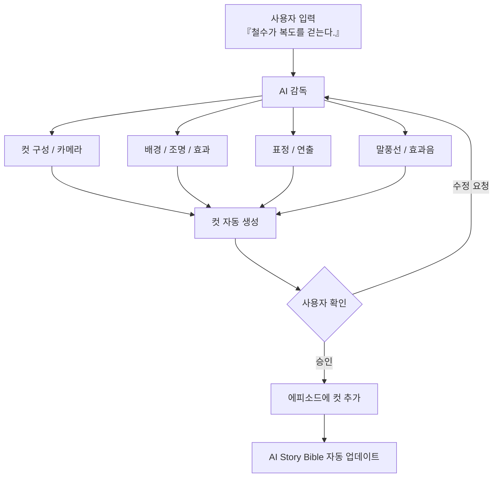

### 2. 자연어 대화형 AI 감독

AI가 연출을 제안하고 다음 참여자를 위한 마무리까지 설계하는 흐름.

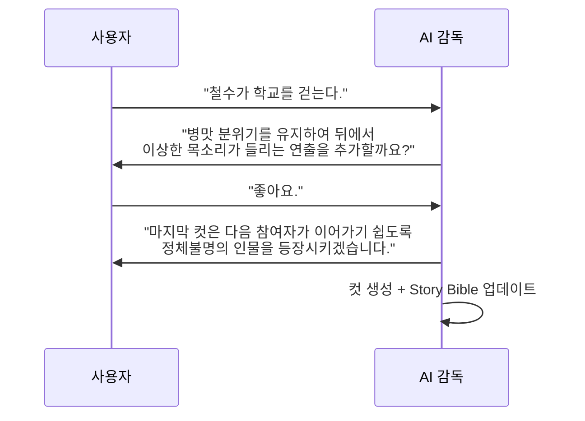

### 3. 3컷 단위 릴레이 (공개 릴레이 모드)

사용자는 원하는 만큼만 그리고, 빈 컷은 AI가 채운다.

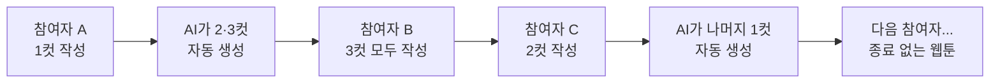

### 4. 브랜치 모드 (평행세계 분기)

원작의 원하는 화에서 새로운 세계선을 만들고, 브랜치에서 다시 브랜치도 가능.

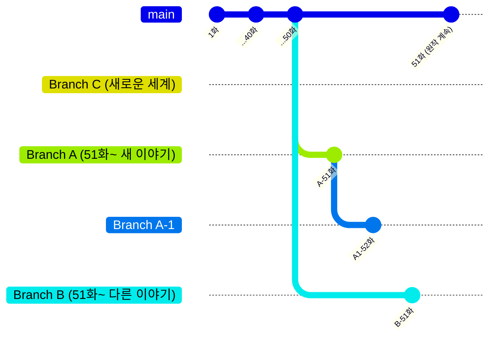

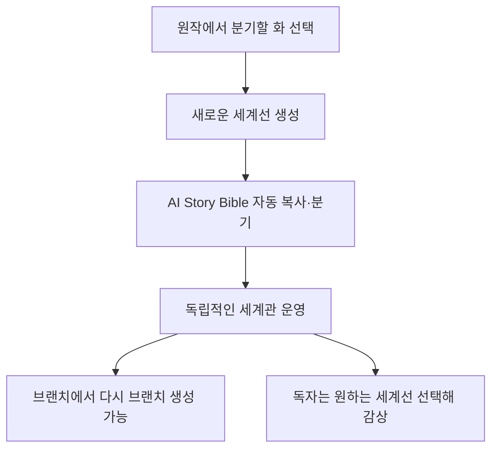

### 5. 비공개 협업 모드 (모임)

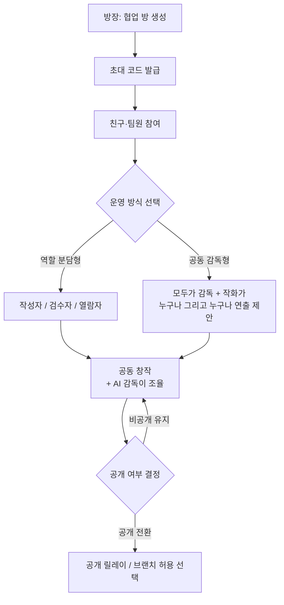

### 6. AI 감독 시스템 (세계관 유지)

새 컷이 추가될 때마다 AI가 설정 일관성을 지키는 흐름.

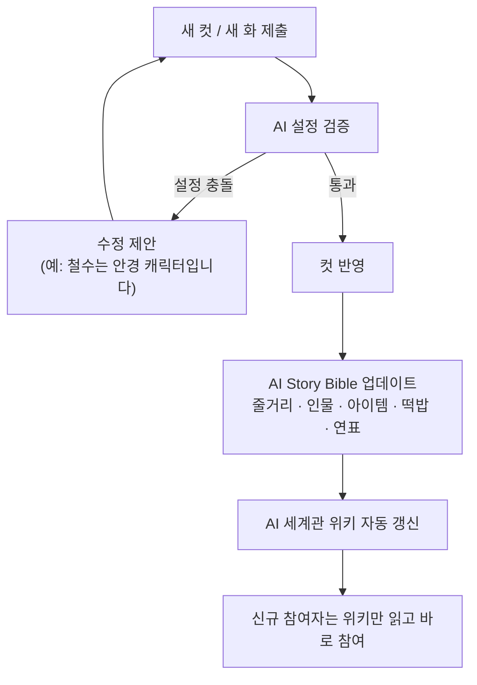

### 7. 수익 분배 & AI 토큰 순환

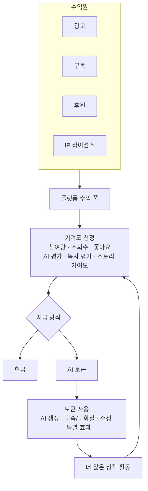

### 8. IP 확장 (향후)

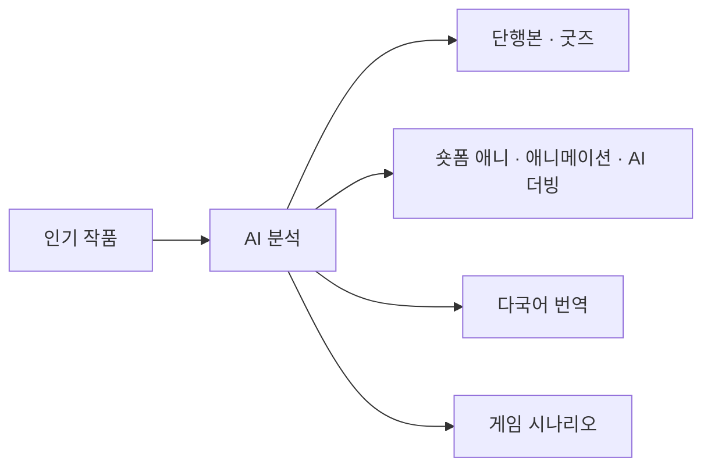

### 9. 설정 변경 — 개연성 심사

방의 규칙 강도에 따라 설정 변경이 처리되는 흐름.

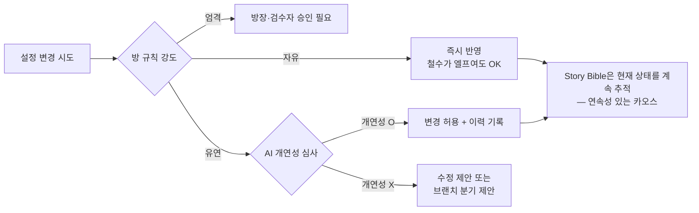

### 10. 비밀 떡밥 라이프사이클

떡밥은 심은 사람만 알고, 회수는 누구나 다르게 할 수 있다.

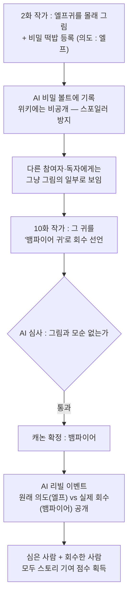
